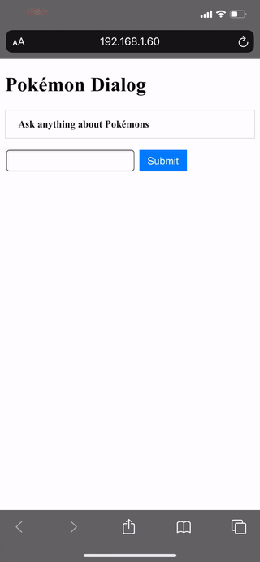

# Pokémon Dialog

This is a chatbot created using [Dialogflow](https://cloud.google.com/dialogflow).
I created this app just for learning purpose.

The frontend is created with [Vue.js](https://vuejs.org/) and [Flask](https://flask.palletsprojects.com/) is used for the backend server.
The Flask server receives user's inputs and calls the Dialogflow's REST API.
If Dialogflow successfully extracts the user's intent with a pokémon name parameter, the server calls the [PokéAPI](https://pokeapi.co/)'s REST API using it and returns the information about the pokémon to the user.

## How to run the app

Go to the [Dialogflow ES Console](https://dialogflow.cloud.google.com/) and import `get-pokemon-info.json` and `name-pokemon.json`. Next, install the dependencies using `pipenv`. Lastly, run the development server with the command `FLASK_APP=server.py FLASK_ENV=development flask run`.
